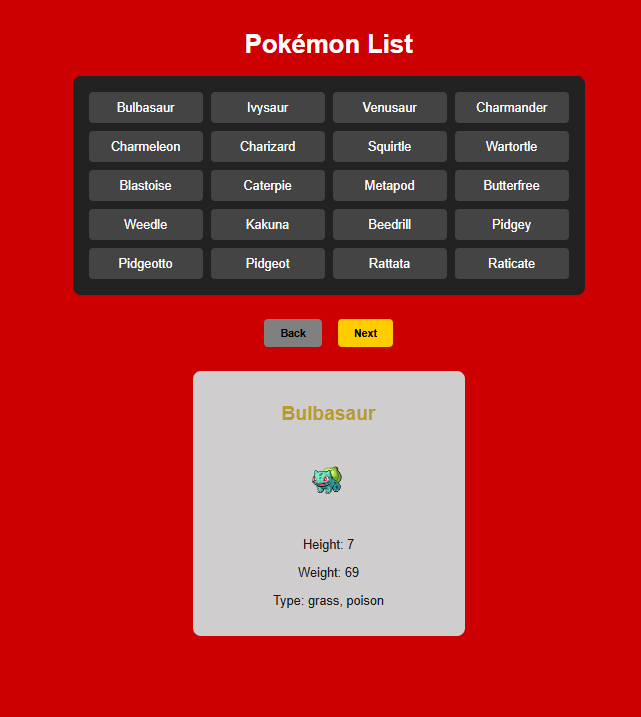

# useEffect Lab

## Learning Goals

- [ ] Use the `useEffect` and `useState` hooks to manage side effects and application state.
- [ ] Fetch data from a third-party API and render it in a React component.
- [ ] Implement pagination logic using state to fetch and display new sets of data.
- [ ] Handle dynamic API requests based on user interaction (e.g., clicking a Pokémon’s name).
- [ ] Explore and extract nested data from a JSON response.

# Lab Deliverables

## 1. Create a React App Using Vite

- Open your terminal and run: **npm create vite@latest my-react-app**
- When prompted:
  - Choose **React**
  - Choose **JavaScript**
- Navigate into your project folder: **cd my-react-app**
- Install dependencies: **npm install**
- Start the development server: **npm run dev**
- Open your browser and go to **http://localhost:5173/** to view your app

## 2. Fetch Data from the Pokémon API

[PokeAPI](https://pokeapi.co/)

- Use the PokeAPI to fetch Pokémon data. You'll need to read the documentation to find the correct route for fetching a group of Pokémon.
- Fetch around 20 Pokémon, store them in state, and render their names in the DOM.
- **Hint:** Getting a response but can’t access the Pokémon? Use `console.log()` or your browser’s debugger to inspect the response and make sure you're accessing the data correctly.

## 3. Next and Prev buttons

- When the **Next** button is clicked, fetch the next set of 20 Pokémon from the API. Be sure to use a `useEffect` hook with a dependency array.
- **Hint:** Use `useState` to track the current offset (i.e., where the fetch should start). When a value in the dependency array changes, `useEffect` will re-run—this is how you can trigger new fetches based on offset changes.
- The **Back** button should fetch the previous 20 Pokémon.
- When you're on the first page (offset 0), the **Back** button should be disabled.

## 4. Fetch a single pokemon

- When a Pokémon’s name is clicked, fetch that specific Pokémon’s data from the API. Check the docs to find the correct URL for this.
- Once the data is fetched, render some of the Pokémon's details in the DOM.
- **Hint:** There's a lot of data in the response! You'll need to explore the response object carefully to decide what to display. Some elements may be deeply nested.

# Example of what the Browser should look like at the end.

